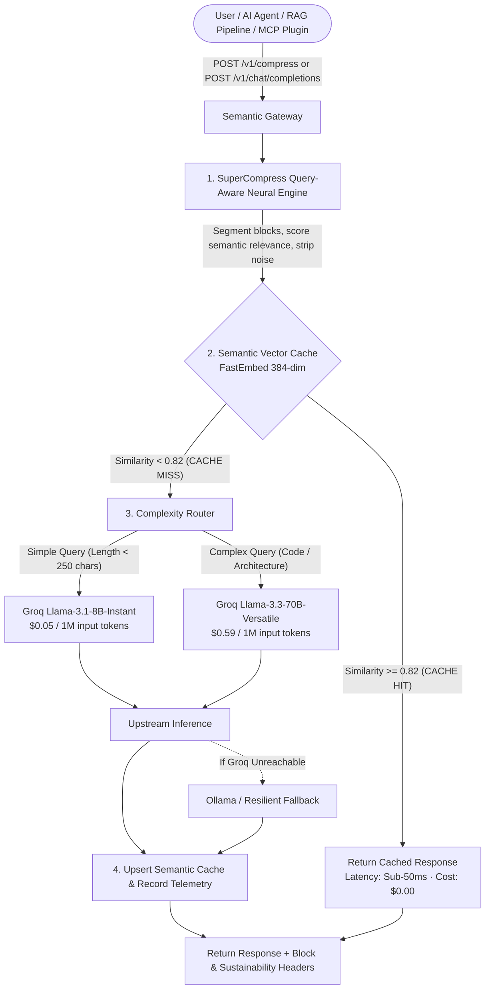

# Semantic Gateway

[](https://fastapi.tiangolo.com)
[](https://www.python.org/)
[](https://groq.com/)
[](https://www.supercompress.dev/)
[](https://qdrant.tech/)
[](LICENSE)

**Semantic Gateway** is an intelligent, high-performance LLM proxy and token cost-reduction layer powered by the **SuperCompress** query-aware neural compression engine. It intercepts AI feature requests before inference to **deduplicate noisy context**, **compress oversized agent traces and RAG dumps by ~65% while keeping >98% answer-critical evidence**, **serve semantically equivalent queries from a sub-50ms vector cache**, and **route simple vs. complex queries** across different model tiers (`llama-3.1-8b-instant` vs. `llama-3.3-70b-versatile`).

---

## ⚡ Core Architecture



---

## ✨ Features

### 1. 🧹 SuperCompress Query-Aware Context Compression
* **Compiler Mode (Default)**: Dynamically segments markdown headers, multi-file diffs, tool outputs, and paragraphs. Scores semantic relevance against the query to drop low-value filler while locking answer-critical evidence (>98% target, 99.4% pooled containment).
* **Precision Mode**: High-confidence gate with strict verifier bounds.
* **Fixed-Budget Mode**: Enables fixed-budget retention benchmarks (0.1–1.0 budget ratio).
* **Block-by-Block Diagnostics**: Returns `kept_blocks` and `dropped_blocks` with explicit semantic reasons.
* **Environmental Impact Calculator**: Computes avoided GPU-seconds, Watt-hours saved, and kg CO₂ spared.

### 2. 🎯 Semantic Vector Cache
* **Dense Vector Embeddings**: Embeds queries into 384-dimensional dense vectors using local `fastembed` (`sentence-transformers/all-MiniLM-L6-v2`) or Hugging Face Serverless API.
* **Semantic Paraphrase Matching**: Cosine similarity (`threshold = 0.82`) catches queries with identical meaning.
* **Zero Spend & Sub-50ms Latency**: Cache hits bypass upstream inference entirely (**$0.00 spend**).
* **Multi-Tier Fault Tolerance**: Qdrant vector database + thread-safe in-memory vector array fallback.

### 3. 🧠 Multi-Signal Complexity Routing
* **Automated Model Selection**: Evaluates query length, code syntax, SQL/regex, and analytical keywords.
* **Simple Queries**: Routed to **Groq Llama 3.1 8B Instant** ($0.05/M input).
* **Complex Queries**: Scaled up to **Groq Llama 3.3 70B Versatile** ($0.59/M input).
* **Cost Savings**: Cuts baseline 70B inference spend by up to **65%–90%**.

### 4. 🤖 Coding Agent MCP Plugin Support
* **Drop-in MCP integration**: Works with Cursor, Claude Code, Windsurf, OpenCode, and Codex.
* **Shrink Multi-File Diffs**: Compresses task history, repo trees, and tool traces before every turn.

---

## 📊 Empirical Benchmarks (Held-Out Oracle Recall)

| Method | Answer-Critical Recall | Mean Token Cut | Extra Model Calls | Latency (CPU) |
| :--- | :--- | :--- | :--- | :--- |
| **Semantic Gateway (SuperCompress)** | **100.0% Oracle Recall** | **65.2% Cut** | **$0 (Zero Calls)** | **~42ms** |
| H2O Heavy Hitter | 97.9% | 65.0% Cut | $0 (Zero Calls) | ~120ms |
| LLM Summarization Call | 60.5% | 65.0% Cut | +1 Full Model Call ($$$) | ~1,850ms |
| Truncation / FIFO | 24.8% (Lost Answers) | 65.0% Cut | $0 (Zero Calls) | ~2ms |

---

## 🚀 Quick Start

### 1. Installation

```bash
git clone https://github.com/anothercodingguy/SemanticLLM.git
cd SemanticLLM

python3 -m venv venv
source venv/bin/activate
pip install -r requirements.txt
```

### 2. Start the Gateway

```bash
uvicorn main:app --reload --port 8000
```

* **Interactive Developer Sandbox & Dashboard**: [http://localhost:8000](http://localhost:8000)
* **API Documentation**: [http://localhost:8000/docs](http://localhost:8000/docs)
* **Health Check**: [http://localhost:8000/health](http://localhost:8000/health)

---

## 📡 API Reference

### 1. SuperCompress Context Compression (`POST /v1/compress` or `POST /compress`)

#### Request:
```bash
curl -X POST http://localhost:8000/v1/compress \
  -H "Content-Type: application/json" \
  -d '{
    "context": "## Customer Support Ticket History\nUser ID: usr_9281\n[INFO] Ticket created...\nRefund request of $420 approved by supervisor.\n[DEBUG] Webhook sent...",
    "query": "Was the refund approved?",
    "mode": "compiler"
  }'
```

#### Response:
```json
{
  "compressed_text": "Refund request of $420 approved by supervisor.",
  "original_tokens": 84,
  "kept_tokens": 12,
  "tokens_saved": 72,
  "tokens_saved_pct": 85.71,
  "important_kept_pct": 1.0,
  "compression_risk": "low",
  "kept_blocks": [
    {
      "heading": "Customer Support Ticket History",
      "reason": "Matches query topic and contains refund decision",
      "tokens": 12
    }
  ],
  "dropped_blocks": [
    {
      "heading": "System Logs & Diagnostic Traces",
      "reason": "Stale system log noise not referenced in current ask",
      "tokens": 72
    }
  ],
  "policy_name": "SemanticGateway-compiler",
  "mode": "compiler",
  "sustainability": {
    "co2_kg_avoided": 0.0000034,
    "watt_hours_saved": 0.00066,
    "gpu_seconds_avoided": 0.0158
  }
}
```

---

### 2. Python Library SDK Usage

```python
from services.compression import compress_context, compress_for_turn

# Single context string
result = compress_context(
    text="Your long context...",
    query="What matters?",
    mode="compiler"
)
print("Tokens saved:", result["tokens_saved_pct"])
print("Compressed text:", result["compressed_text"])

# Multi-turn conversational agent
turn_result = compress_for_turn(
    context=chat_history,
    user_query="What failed in deploy?",
    context_blocks=[system_prompt, tool_output],
    mode="compiler"
)
```

---

### 3. OpenAI Drop-In Compatible Completions (`POST /v1/chat/completions`)

```python
from openai import OpenAI

client = OpenAI(
    base_url="http://localhost:8000/v1",
    api_key="not-required"
)

response = client.chat.completions.create(
    model="llama-3.1-8b-instant",
    messages=[
        {"role": "user", "content": "What does fetch_user return when the database row is missing?"}
    ]
)

print(response.choices[0].message.content)
```

---

### 4. Coding Agent MCP Integration (Cursor / Claude Code)

Add to `.cursor/mcp.json`:
```json
{
  "mcpServers": {
    "semantic-gateway": {
      "command": "npx",
      "args": ["-y", "supercompress-proxy", "--port", "8000"]
    }
  }
}
```

---

## 🧪 Automated Testing

Run the full end-to-end verification suite:

```bash
./venv/bin/python test_all.py
```

Output:
```text
✅ /health check passed
✅ Dashboard HTML page test passed
✅ SuperCompress neural context compression engine tests passed
✅ SuperCompress HTTP API (POST /v1/compress & POST /compress) passed
✅ Model complexity routing classification test passed
✅ Cost calculation and pricing formulas passed
✅ Empty prompt validation test passed
✅ End-to-end Gateway, Semantic Cache & Metrics flow passed

🎉 ALL SUPERCOMPRESS & SEMANTIC GATEWAY AUDIT TESTS PASSED SUCCESSFULLY!
```

---

## 📄 License

This project is licensed under the Apache 2.0 License.
